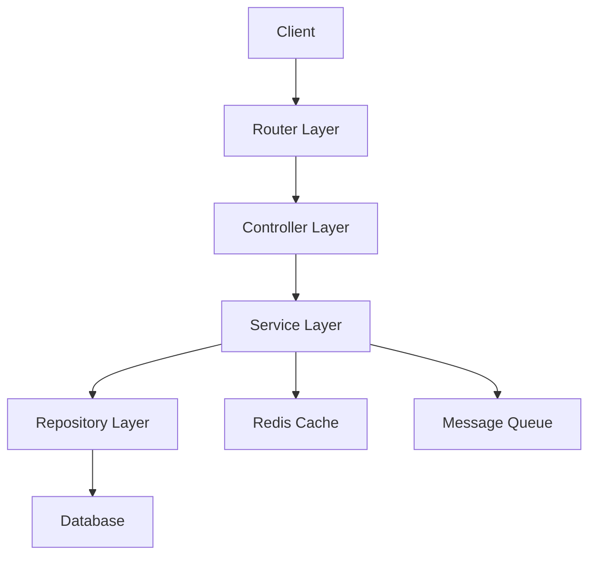
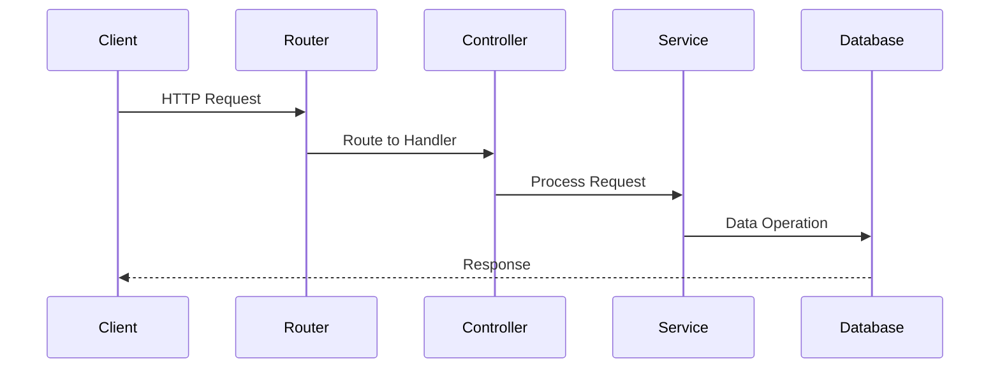
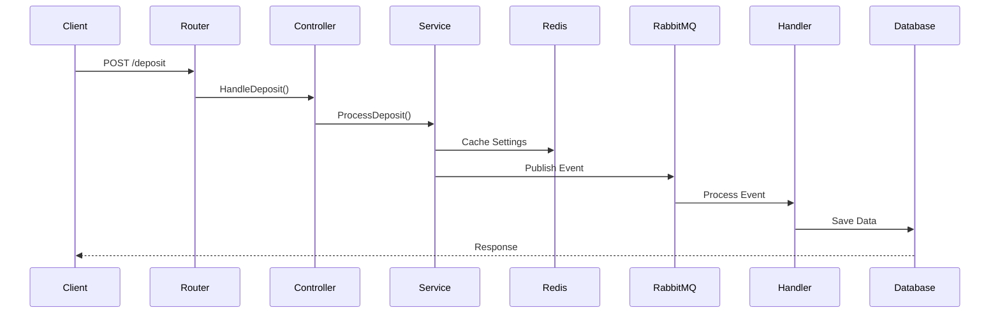

# Banking System API

A robust banking system API built with Go that provides essential banking operations including deposits, withdrawals, interest calculations, and transaction management.

## 🚀 Features

### Core Banking Operations
- ✅ Deposit Management
- ✅ Withdrawal Processing
- ✅ Fee Charging System
- ✅ Interest Calculation
- ✅ Balance Inquiries
- ✅ Transaction History

### Technical Features
- ✅ Message Queue Integration
- ✅ Webhook Support
- ✅ Structured Logging
- ✅ Configuration Management
- ✅ Database Integration
- ✅ Redis Caching
- ✅ Rate Limiting

## 🛠️ Technology Stack

- **Language:** Go
- **Cache:** Redis
- **Message Queue:** RabbitMQ
- **Documentation:** Swagger
- **Configuration:** YAML

## 📁 Project Structure

```
.
├── cmd/
│   └── server/
│       └── main.go          # Application entry point
├── config/
│   └── config.yaml         # Configuration files
├── internal/
│   ├── controller/         # HTTP request handlers
│   ├── model/             # Data models
│   ├── messaging/         # Message queue handlers
│   ├── initialize/        # Application initialization
│   ├── repository/        # Data access layer
│   ├── service/          # Business logic
│   ├── utils/            # Utility functions
│   ├── po/               # Persistent objects
│   ├── vo/               # Value objects
│   ├── wire/             # Dependency injection
│   ├── worker/           # Background workers
│   ├── middlewares/      # HTTP middlewares
│   ├── routers/          # Route definitions
│   └── util/             # Common utilities
├── pkg/
│   ├── security/         # Security utilities
│   ├── rabbitmq/         # RabbitMQ client
│   ├── logger/           # Logging package
│   ├── consts/           # Constants
│   ├── webhook/          # Webhook handlers
│   └── setting/          # Settings management
└── .env                  # Environment variables
```

## 🚦 Getting Started

### Prerequisites

- Go 1.22 or higher
- Redis
- RabbitMQ
- Database (specified in your configuration)

### Installation

1. Clone the repository
```bash
git clone <repository-url>
```

2. Install dependencies
```bash
go mod download
```

3. Set up environment variables
```bash
cp .env.example .env
# Edit .env with your configuration
```

### Generate Swagger Documentation
```bash
swag init -g cmd/server/main.go
```

### Running the Application

Development mode:
```bash
make dev
```

Or directly:
```bash
go run cmd/server/main.go
```

## 📚 API Documentation

Once the application is running, access the Swagger documentation at:
```
http://localhost:{port}/swagger/index.html
```

## ⚙️ Configuration

The application can be configured through:
- Environment variables
- config.yaml file
- Command line flags

## 🔒 Security

- Rate limiting implemented
- Authentication/Authorization
- Secure API endpoints
- Input validation

## 🤝 Contributing

1. Fork the repository
2. Create your feature branch
3. Commit your changes
4. Push to the branch
5. Create a new Pull Request

## 📄 License

[MIT](https://opensource.org/licenses/MIT)

## 📞 Support

[minh352623@gmail.com]

This README provides a comprehensive overview of your banking system API. You may want to add or modify sections based on:

1. Specific installation requirements
2. Detailed API endpoint documentation
3. Configuration options
4. Deployment instructions
5. Testing procedures
6. Contributing guidelines
7. License information
8. Support channels

Would you like me to expand on any particular section?
# Banking System API Documentation 🏦

## Table of Contents
1. [System Overview](#1-system-overview)
2. [API Architecture](#2-api-architecture)
3. [Flow Diagrams](#3-flow-diagrams)
4. [Implementation Guide](#4-implementation-guide)
5. [Error Handling](#5-error-handling)
6. [Testing Strategy](#6-testing-strategy)
7. [Best Practices](#7-best-practices)

## 1. System Overview

### 1.1 Core Components
- **API Layer**: HTTP endpoints and request handling
- **Service Layer**: Business logic implementation
- **Data Layer**: Database operations and caching
- **Message Queue**: Asynchronous processing
- **Cache**: Redis for performance optimization

### 1.2 Technology Stack
- Go 1.22+
- PostgreSQL
- Redis
- RabbitMQ
- JWT Authentication

## 2. API Architecture

### 2.1 Layer Structure


### 2.2 Layer Responsibilities

| Layer | Purpose | Location | Responsibility |
|-------|---------|----------|----------------|
| Router | Request routing | `/internal/routers` | URL mapping, middleware |
| Controller | Request handling | `/internal/controller` | Input validation, response formatting |
| Service | Business logic | `/internal/service` | Core business rules, orchestration |
| Repository | Data access | `/internal/repository` | Database operations |

## 3. Flow Diagrams

### 3.1 General Request Flow


### 3.2 Deposit Flow Example


## 4. Implementation Guide

### 4.1 API Endpoint Example
```http
POST /api/v1/accounts/{id}/deposit
Authorization: Bearer {token}
Content-Type: application/json

{
    "amount": 1000.00,
    "currency": "USD",
    "description": "Initial deposit"
}
```

### 4.2 Router Implementation
```go
// internal/routers/router.go
func SetupRoutes(mux *http.ServeMux) {
    mux.HandleMethod("POST", "/api/v1/accounts/{accountId}/deposit", 
        middleware.Chain(
            controller.HandleDeposit,
            middleware.Auth,
            middleware.RateLimit
        ),
    )
}
```

### 4.3 Controller Implementation
```go
// internal/controller/deposit_controller.go
func (c *DepositController) HandleDeposit(w http.ResponseWriter, r *http.Request) {
    var req DepositRequest
    if err := json.NewDecoder(r.Body).Decode(&req); err != nil {
        c.handleError(w, ErrInvalidRequest)
        return
    }
    
    result, err := c.service.ProcessDeposit(r.Context(), req.ToModel())
    if err != nil {
        c.handleError(w, err)
        return
    }
    
    c.sendResponse(w, result)
}
```

### 4.4 Service Implementation
```go
// internal/service/deposit_service.go
func (s *DepositService) ProcessDeposit(ctx context.Context, deposit *Deposit) (*Deposit, error) {
    // 1. Get cached settings
    settings, err := s.redis.GetSettings(ctx, deposit.AccountID)
    if err != nil {
        return nil, fmt.Errorf("failed to get settings: %w", err)
    }

    // 2. Validate deposit
    if err := s.validateDeposit(deposit, settings); err != nil {
        return nil, err
    }

    // 3. Publish event
    if err := s.mqPublisher.PublishDeposit(ctx, deposit); err != nil {
        return nil, fmt.Errorf("failed to publish deposit: %w", err)
    }

    return deposit, nil
}
```

## 5. Error Handling

### 5.1 Error Types
```go
// internal/errors/deposit_errors.go
var (
    ErrInvalidAmount   = errors.New("invalid deposit amount")
    ErrInvalidCurrency = errors.New("invalid currency")
    ErrExceedsLimit    = errors.New("deposit exceeds limit")
)
```

### 5.2 Error Response Format
```json
{
    "error": {
        "code": "INVALID_AMOUNT",
        "message": "The deposit amount must be greater than zero",
        "details": {
            "minimum": 0.01,
            "currency": "USD"
        }
    },
    "requestId": "req-123-456"
}
```

## 6. Testing Strategy

### 6.1 Unit Test Example
```go
// internal/service/deposit_service_test.go
func TestDepositService_ProcessDeposit(t *testing.T) {
    tests := []struct {
        name    string
        deposit *Deposit
        want    *Deposit
        wantErr error
    }{
        {
            name: "successful deposit",
            deposit: &Deposit{
                Amount:   100.00,
                Currency: "USD",
            },
            want: &Deposit{
                Amount:   100.00,
                Currency: "USD",
                Status:   "completed",
            },
            wantErr: nil,
        },
    }
    // Test implementation
}
```

## 7. Best Practices

### 7.1 Code Organization
- Follow standard Go project layout
- Use meaningful package names
- Implement interfaces for testability
- Keep functions focused and small

### 7.2 Error Handling
- Use custom error types
- Provide context with errors
- Log errors appropriately
- Return meaningful error messages

### 7.3 Performance
- Implement caching strategically
- Use connection pooling
- Handle goroutines properly
- Monitor memory usage

### 7.4 Security
- Validate all inputs
- Use prepared statements
- Implement rate limiting
- Follow authentication best practices

### 7.5 Logging
```go
// Example logging pattern
logger.Info("Processing deposit",
    "accountId", deposit.AccountID,
    "amount", deposit.Amount,
    "currency", deposit.Currency,
    "requestId", ctx.Value(RequestIDKey),
)
```

implement  Retry with Exponential Backoff + Dead Letter Queue (DLQ), Idempotency